<div align="center">
  
  <h1>NULL Protocol</h1>
  <p><strong>Private ENS Payouts for Ethereum. Distribute value without exposing salaries to the world.</strong></p>

  <p>
    <a href="https://null-protocol.netlify.app/"></a>
    <a href="https://www.npmjs.com/package/@samarth208p/null-payouts"></a>
    <a href="LICENSE"></a>
    <a href="docs/SPONSOR_EVIDENCE.md"></a>
  </p>

  <p>
    <a href="https://null-protocol.netlify.app/">Open Web App</a> •
    <a href="docs/SDK_INTEGRATION.md">SDK Integration Guide</a> •
    <a href="docs/SUBMISSION_DEMO.md">Demo Walkthrough</a> •
    <a href="docs/PAYOUT_V3_VERIFICATION.md">Verification Evidence</a>
  </p>
</div>

---

## Overview

**NULL** is an embeddable TypeScript toolkit and zero-knowledge protocol for private payouts on Ethereum. Organizations can pay contributors simply by entering their **ENS names and amounts** without publishing a plaintext recipient-and-amount roster on chain.

The toolkit resolves receiving encryption keys via **ENSv2**, compiles encrypted delivery envelopes, coordinates **Chainlink CRE** confidential validation, and binds **Privy** organization owner quorum before broadcasting funds to an onchain pool (`NullPool`). Recipients discover incoming payouts via local browser key-scanning, generate **Noir UltraHonk** zero-knowledge proofs to claim against a global distribution accumulator, and withdraw funds to an exit address—with full support for **private partial withdrawals**.

```sh
npm install @samarth208p/null-payouts@preview
```

---

## Core Features

- ⚡ **ENS-First Identity & Delegation:** Send payouts to human-readable ENS names (`alice.eth`). Powered by ENSv2 **Permissioned Resolvers** (`authorizeTextRoles`) so recipients can delegate payment-profile management without surrendering domain ownership.
- 🛡️ **Zero-Knowledge Privacy (Noir UltraHonk):** Claims prove membership in a global accumulator tree without disclosing the source distribution batch in public inputs.
- 🔒 **Confidential Compute (Chainlink CRE):** A TypeScript `handlerInTee` fetches authenticated payroll records and deterministically compiles encrypted envelopes inside an enclave boundary.
- 🏛️ **Institutional Governance (Privy):** Enforces organization owner quorum and server wallet policies with single-use, session-bound intent tickets that bind the chain, pool, and batch digest.
- 💸 **Private Partial Withdrawals:** Recipients can withdraw a chosen amount to a fresh wallet while automatically rolling the remaining change into a newly generated private note.
- 📦 **Embeddable TypeScript SDK:** Framework-independent core packages (`@null-protocol/payouts`) allow teams to drop private payroll directly into existing DAO tools or custom treasury apps.

---

## The Payment Workflow

```mermaid
flowchart LR
  ENS["1. ENSv2 Scoped Profile<br/>(Local keys & text roles)"] --> Resolve["2. Resolve Recipients<br/>(Safety snapshots & pre-flight)"]
  Resolve --> CRE["3. Chainlink CRE Handler<br/>(Confidential TEE compilation)"]
  CRE --> Match["4. Enclave Integrity Check<br/>(Draft checksum match)"]
  Match --> Approve["5. Privy Owner Quorum<br/>(Bound intent authorization)"]
  Approve --> Pool["6. NullPool Distribution<br/>(8 padded ciphertext slots)"]
  Pool --> Graph["7. The Graph Subgraph<br/>(Real-time event indexing)"]
  Graph --> Claim["8. Local Scan & Noir Proof<br/>(Hidden-source ZK claim)"]
  Claim --> Exit["9. Public / Partial Exit<br/>(Funds exit + private change)"]
```



1. **Recipient Sets Up an ENS Inbox:** User generates a private keypair locally and links their Sepolia ENSv2 name by setting a scoped `null.paymentProfile` record.
2. **Organization Compiles Draft:** The sender enters ENS names and amounts (or imports a CSV). The compiler validates names and builds an 8-slot padded, encrypted payload bundle.
3. **Confidential CRE Verification:** The private draft executes through Chainlink CRE's `handlerInTee` to validate payroll allocations against API secrets.
4. **Owner Quorum Approval:** Privy server wallets sign an expiring authorization ticket locked to the exact chain, contract, and batch root.
5. **Onchain Distribution:** Funds are deposited and encrypted envelopes are broadcast to `NullPool`.
6. **Local Discovery & Noir ZK Claim:** The Graph indexes public events; the recipient's browser scans ciphertext, generates an UltraHonk proof, and claims the allocation without revealing the source batch.
7. **Withdrawal:** The recipient executes a standard exit or a partial withdrawal with private change.

---

## Developer Quickstart

Integrate private ENS payouts into any TypeScript application:

```typescript
import { createPublicClient, http } from 'viem';
import { sepolia } from 'viem/chains';
import { preparePayout, resolvePayoutRecipients } from '@null-protocol/payouts';

const client = createPublicClient({ chain: sepolia, transport: http() });

// 1. Resolve ENS names to onchain encryption profiles
const recipients = await resolvePayoutRecipients(client, [
  { reference: 'contributor-1', name: 'alice.nullpay2026.eth', amount: '0.05' },
  { reference: 'contributor-2', name: 'bob.nullpay2026.eth', amount: '0.025' },
]);

// 2. Compile 8-slot encrypted payload batch
const draft = await preparePayout({
  ens: client,
  context: {
    chainId: 11155111n,
    poolAddress: '0x17A41574900ca3120562Ae5616559EceebA74E36',
  },
  recipients,
});

console.log('Batch commitment root:', draft.publicBundle.commitment);
console.log('Encrypted delivery slots:', draft.publicBundle.envelopes.length);
```

Check the [integration guide](docs/SDK_INTEGRATION.md) and [framework-independent example](apps/payout-example/) for full documentation.

---

## Partner Integrations & Evidence

| Partner | Role in NULL | Implementation & Evidence |
| :--- | :--- | :--- |
| **[ENSv2](docs/ENS_INTEGRATION.md)** | Required receiving names, subnames, aliases, and scoped resolver delegation | [`packages/ens/src/index.ts`](packages/ens/src/index.ts) • [Sepolia transactions](deployments/ens-sepolia.json) • [ENS Status](deployments/ens-status-2026-09-12.json) |
| **[Privy](services/organization/)** | Server wallets, B2B owner quorum, and session-bound intent tickets | [`packages/auth/src/server.ts`](packages/auth/src/server.ts) • [`services/organization/src/intents.ts`](services/organization/src/intents.ts) |
| **[Chainlink CRE](services/cre-workflow/)** | `handlerInTee` confidential payroll compiler and CLI simulator | [`cre-starter/payroll/workflow.ts`](cre-starter/payroll/workflow.ts) • [Simulation Receipt](deployments/cre-simulation-2026-09-12.json) |
| **[Noir & Aztec](circuits/)** | 5 UltraHonk ZK circuits: shield, distribution, claim, exit, and partial exit | [`circuits/`](circuits/) • [Local Rehearsal](deployments/payment-flow-sepolia-v3.json) • [v0.3 Verifier Specs](docs/PAYOUT_V3_VERIFICATION.md) |
| **[The Graph](subgraph/)** | Event indexing for public ciphertext scanning with RPC fallback | [`subgraph/subgraph.yaml`](subgraph/subgraph.yaml) • [Sepolia Subgraph Endpoint](https://api.studio.thegraph.com/query/1758859/null-protocol/v0.3.0) |

For sponsor judges, the **[Sponsor Evidence Walkthrough](docs/SPONSOR_EVIDENCE.md)** maps exact requirements to code, recorded runs, and verification limits.

---

## Deployed Contracts (Ethereum Sepolia - 11155111)

The [canonical deployment manifest](apps/web/public/deployment.json) contains bytecode hashes and circuit checksums:

| Contract | Address |
| :--- | :--- |
| **NullPoolV3** | [`0x17A41574900ca3120562Ae5616559EceebA74E36`](https://sepolia.etherscan.io/address/0x17A41574900ca3120562Ae5616559EceebA74E36) |
| **NullAuthRegistry** | [`0x126ec72460f84f8DDC7A81aCE153982373b92DE9`](https://sepolia.etherscan.io/address/0x126ec72460f84f8DDC7A81aCE153982373b92DE9) |
| **Shield Verifier** | [`0x3637802C52421Cadb6420d2A529515E3A1bD9aAF`](https://sepolia.etherscan.io/address/0x3637802C52421Cadb6420d2A529515E3A1bD9aAF) |
| **Distribution Verifier** | [`0x016Cd5EB253e57a507432a24CE71F919DE503040`](https://sepolia.etherscan.io/address/0x016Cd5EB253e57a507432a24CE71F919DE503040) |
| **Claim Verifier** | [`0x4b1a60aC45E08503Be4660956Cb48E90ac2A9257`](https://sepolia.etherscan.io/address/0x4b1a60aC45E08503Be4660956Cb48E90ac2A9257) |
| **Full Withdrawal Verifier** | [`0xa7605191B82657B3e91cA198cBb0f32ce2503A22`](https://sepolia.etherscan.io/address/0xa7605191B82657B3e91cA198cBb0f32ce2503A22) |
| **Partial Withdrawal Verifier** | [`0x8Ff182757c668973FA243A2BB630dC755Eb6057F`](https://sepolia.etherscan.io/address/0x8Ff182757c668973FA243A2BB630dC755Eb6057F) |

---

## Local Development & Testing

Requires **Node.js >=22.16.0** and **pnpm 11.9.0**:

```sh
# 1. Install workspace dependencies
pnpm install --frozen-lockfile

# 2. Start local web app & services
pnpm dev             # Web frontend at http://127.0.0.1:5173
pnpm dev:all         # Frontend + background API services

# 3. Run full verification suite
pnpm check           # Workspace TypeScript checks
pnpm test:submission # ENS, CRE imports, Privy controls, and storage tests
pnpm test:payouts    # SDK boundaries and multi-batch reconciliation
pnpm test:flow-v3    # Full ZK lifecycle test on isolated local chain
pnpm ens:status      # Read-only live ENS resolution verification
pnpm cre:simulate    # Real CRE CLI confidential handler simulation
```

---

## Repository Structure

```
├── apps/
│   ├── web/                     # React/Vite web application & wizard UI
│   └── payout-example/          # Standalone framework-independent integration
├── packages/
│   ├── payouts/                 # High-level ENS payout orchestration API
│   ├── ens/                     # ENSv2 resolver, hierarchy, and permission guards
│   ├── sdk/                     # Core batch compiler and cryptographic wire format
│   ├── crypto/                  # secp256k1 key derivation, HKDF, and AES-GCM
│   ├── protocol/                # Poseidon trees, witnesses, and types
│   ├── client/                  # Chain orchestration, indexing, and reconciliation
│   ├── auth/                    # Privy server authorizer & policy verification
│   └── wallet/                  # Encrypted IndexedDB recovery and proving workers
├── circuits/                    # 5 Noir UltraHonk zero-knowledge circuits
├── contracts/                   # Solidity contracts (NullPoolV3, AuthRegistry, Verifiers)
├── services/
│   ├── cre-workflow/            # Shared compiler and CRE service
│   └── organization/            # Privy B2B intent service
├── cre-starter/                 # Chainlink CRE starter workspace & handlerInTee
└── subgraph/                    # The Graph Sepolia event indexer
```

---

## Privacy Boundaries & Security Scope

> [!NOTE]
> **Unaudited Testnet Prototype:** NULL is built for testnet demonstration on Sepolia.
> - **Public Boundaries:** Initial deposits, final exit transfers, and ENS registrations are public onchain events.
> - **Cryptographic Guarantees:** Recipient batch membership, individual allocations, and claim sources are completely hidden within the zero-knowledge distribution accumulator.
> - **Confidential Compute:** Demonstrated Chainlink CRE integration runs via the authentic CRE CLI simulator.

See [Privacy Guarantees](docs/PRIVACY_GUARANTEES.md), [Security Scope](SECURITY.md), and [Build Provenance](docs/BUILD_PROVENANCE.md) for detailed technical specifications.

---

<div align="center">
  <sub>Built for ETHOnline 2026. Licensed under the <a href="LICENSE">MIT License</a>.</sub>
</div>
