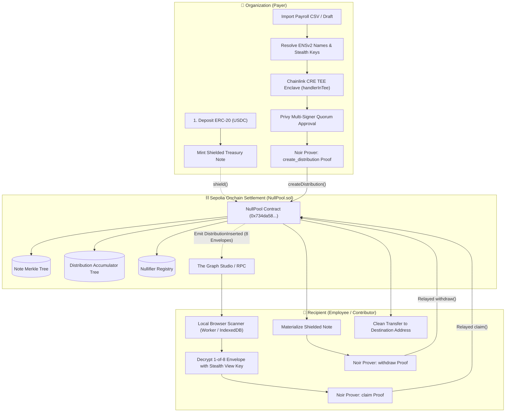
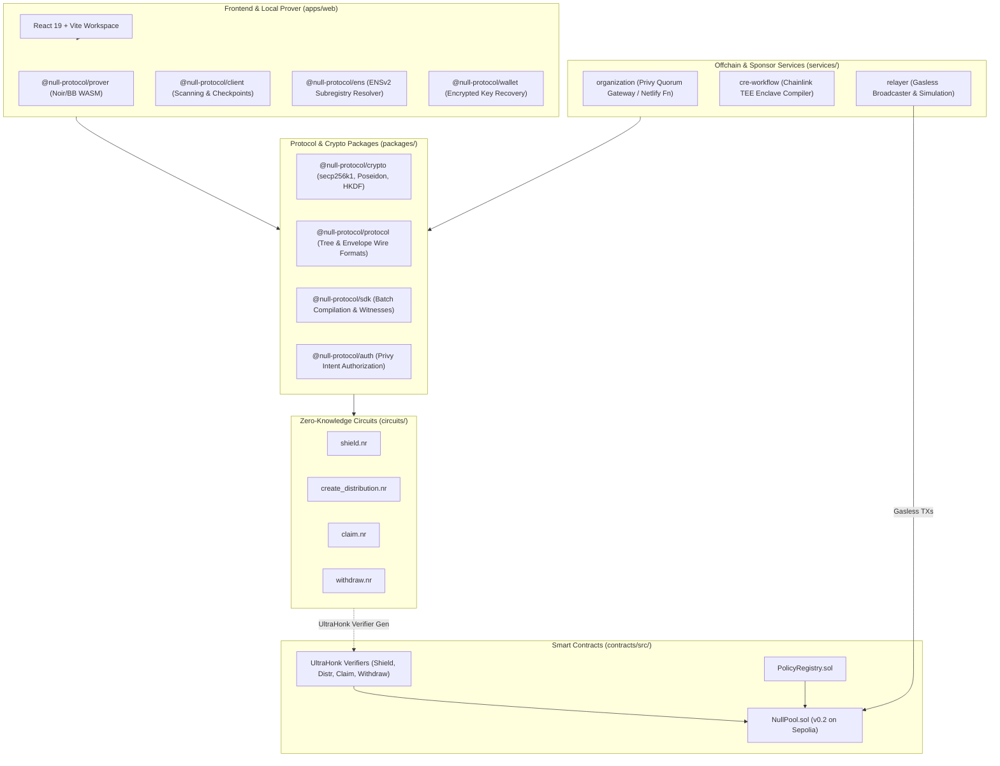

<div align="center">
  
  <h1>NULL Protocol</h1>
  <p><strong>Private distribution infrastructure for Ethereum. Distribute value, reveal nothing.</strong></p>

  <p>
    <a href="https://sepolia.etherscan.io/address/0x734da58C285D211e7C0ad904f522c221c982447E"></a>
    <a href="https://null-protocol.netlify.app/"></a>
    <a href="circuits/"></a>
    <a href="docs/ENS_INTEGRATION.md"></a>
    <a href="services/organization/"></a>
    <a href="services/cre-workflow/"></a>
  </p>
</div>

NULL is a zero-knowledge protocol and reference application for **funded private entitlements**. Organizations can execute bulk payouts (such as employee payroll, contractor payments, grants, or DAO rewards) in a single transaction without exposing recipient identities, individual amounts, or public receiving addresses.

Recipients discover their funds locally through **ENS-linked stealth keys** and claim them as shielded notes via **Noir ZK-SNARKs** — breaking the cryptographic link between the funding batch and the destination wallet.

### 🤝 Powered By Our Partners
* **[ENSv2](docs/ENS_INTEGRATION.md):** Scoped subregistry delegation (`authorizeTextRoles`) enables workers to link stealth payment profiles under human-readable names (e.g., `inbox.nullpay2026.eth`) without exposing destination addresses.
* **[Privy](services/organization/):** Enforces enterprise B2B governance via multi-signer owner quorum policies over distribution intents, paired with frictionless embedded recipient wallet onboarding.
* **[Chainlink CRE](services/cre-workflow/):** Executes confidential offchain payroll computation and 8-slot encrypted envelope derivation inside a hardware-enforced TEE enclave (`handlerInTee`).
* **[Noir ZK-SNARKs](circuits/):** 4 custom UltraHonk circuits prove balance conservation, policy compliance, stealth entitlement, and private note withdrawals with zero leakage.
* **[The Graph](subgraph/):** Indexes public privacy events and ciphertext envelopes via Graph Studio v0.2.0, powering fast in-browser scanning with automatic RPC fallback.

---

## 💡 Why NULL? The Onchain Payroll Paradox

Paying contributors and employees on public blockchains today is fundamentally broken:

| The Public Ledger Problem | Why Real Businesses Suffer |
| :--- | :--- |
| 🚨 **Salary Doxxing on Etherscan** | Every team member's exact salary, bonus, and raise is public knowledge. |
| 🚨 **NDA & Trade Secret Breaches** | Vendor rates and contractor agreements are exposed, violating legal confidentiality clauses. |
| 🚨 **Internal Workplace Friction** | Public wage transparency creates resentment and destroys team morale. |
| 🚨 **Targeting & Phishing Risks** | High earners are permanently linked to their wallets, inviting social engineering and physical security threats. |

NULL brings **enterprise-grade financial confidentiality** to Ethereum without resorting to compliance-hostile blackbox mixers.

---

## ⚡ How It Works



1. **Shielded Treasury:** Payer deposits funds into the NULL pool contract, minting a private treasury note.
2. **Confidential Distribution:** Payer creates an 8-slot batch. A **Noir ZK proof** enforces exact value conservation and organization policy authorization without revealing individual allocation amounts.
3. **Stealth Delivery:** Envelopes are encrypted using **secp256k1 stealth addresses (ERC-5564)** and posted onchain.
4. **Local Discovery & Claim:** Recipient scans the chain locally in browser IndexedDB/worker, discovers their allocation via view-tags, and generates a **ZK Claim Proof** to materialize a private note.
5. **Private Exit:** The recipient can withdraw any unspent note to any fresh address at their own leisure.

---

## 🛠️ Tech Stack & Sponsor Integrations

* **Zero-Knowledge Circuits:** 4 custom [Noir](circuits/) circuits (`shield`, `create_distribution`, `claim`, `withdraw`) compiled with Barretenberg UltraHonk EVM verifiers.
* **Smart Contracts:** Solidity v0.8.28 pool ([contracts/src/Pool.sol](contracts/src/Pool.sol)) featuring Poseidon Merkle trees, double-spend nullifier registries, and exact ERC-20 accounting.
* **ENSv2 Subregistry & Permissions:** Uses [ENSv2](tools/ens/) subnames (e.g., `inbox.nullpay2026.eth`) with `authorizeTextRoles` for scoped, delegated payment profile management.
* **Privy B2B Quorum:** Multi-signer treasury governance ([services/organization/](services/organization/)) executing cryptographic approvals over Poseidon intent digests.
* **Chainlink Runtime Environment (CRE):** Confidential compute workflow ([services/cre-workflow/](services/cre-workflow/)) running `handlerInTee` to process sensitive offchain payroll datasets in a hardware enclave.
* **The Graph:** High-performance public indexing via Graph Studio Subgraph v0.2.0 ([subgraph/](subgraph/)) with automatic RPC fallback.

---

## 🚀 Quickstart

### Prerequisites
* **Node.js:** `>= 22.16.0`
* **pnpm:** `>= 11.9.0`

### 1. Install & Start Web App
```sh
# Enable corepack and install dependencies
corepack enable
pnpm install --frozen-lockfile

# Start the local development server
pnpm dev
```
Open **[http://127.0.0.1:5173](http://127.0.0.1:5173)** in your browser.

### 2. Workspace Commands
```sh
pnpm build              # Compile TypeScript and bundle production web app
pnpm check              # Run workspace-wide typechecks
pnpm test:submission    # Run full submission test suite (27 passing tests)
pnpm test:domains       # Validate SDK, Noir, and Solidity domain parity
pnpm build:contracts    # Compile Solidity contracts and export ABIs
pnpm circuits:build     # Build Noir circuits and generate EVM verifiers
pnpm cre:simulate       # Run Chainlink CRE CLI confidential simulation
```

---

## 🌐 Live Sepolia Deployment (v0.2)

| Contract / Service | Address / URL |
| :--- | :--- |
| **NULL Pool v0.2** | [`0x734da58C285D211e7C0ad904f522c221c982447E`](https://sepolia.etherscan.io/address/0x734da58C285D211e7C0ad904f522c221c982447E) |
| **Shield Verifier** | [`0xE66cf296c09b2EBE9c3Efa8786938d21c322765A`](https://sepolia.etherscan.io/address/0xE66cf296c09b2EBE9c3Efa8786938d21c322765A) |
| **Distribution Verifier** | [`0xDaeF155160875C96f30d075D1cbD6C6415a7702f`](https://sepolia.etherscan.io/address/0xDaeF155160875C96f30d075D1cbD6C6415a7702f) |
| **Claim Verifier** | [`0xc80436dFf8541e2A8d03541A13C07914436573c5`](https://sepolia.etherscan.io/address/0xc80436dFf8541e2A8d03541A13C07914436573c5) |
| **Withdraw Verifier** | [`0x9599553f1B981C53faC9cEc7538c823A4A3eB4C1`](https://sepolia.etherscan.io/address/0x9599553f1B981C53faC9cEc7538c823A4A3eB4C1) |
| **Policy Registry** | [`0x5f9Fe77D3222eE2A346C005F999D39031c519c2C`](https://sepolia.etherscan.io/address/0x5f9Fe77D3222eE2A346C005F999D39031c519c2C) |
| **Graph Subgraph v0.2.0** | [Studio Endpoint](https://api.studio.thegraph.com/query/1758859/null-protocol/v0.2.0) |
| **ENS Test Domain** | `inbox.nullpay2026.eth` (Sepolia ENSv2 Permissioned Resolver) |

*Full deployment details & verified transaction receipts are recorded in [deployments/payment-flow-sepolia-v2.json](deployments/payment-flow-sepolia-v2.json).*

---

## 📂 System & Repository Architecture



```text
apps/
  web/               # React 19 + Vite frontend (local worker proving, IndexedDB scanner)
packages/
  crypto/            # secp256k1 stealth derivation, Poseidon hashing, HKDF domains
  protocol/          # Tree accumulators, commitments, 8-slot envelope wire formats
  sdk/               # Batch compilation, scanning, and Noir witness builders
  wallet/            # Encrypted recipient keys and funds backup manager
  prover/            # Local Noir / Barretenberg WebAssembly prover worker
  client/            # Client orchestration, RPC fallback, and receipt reconciliation
  contracts/         # Generated TypeScript bindings and contract ABIs
  auth/              # Privy organization quorum and intent signing adapter
  graph-client/      # The Graph Studio client + fallback log poller
contracts/           # Solidity smart contracts and automated deployment pipeline
circuits/            # 4 Noir ZK-SNARK circuits + pinned Barretenberg verifiers
services/
  organization/      # Authenticated Privy organization quorum server / Netlify Function
  relayer/           # Gasless transaction relay service with bounded gas validation
  cre-workflow/      # Chainlink CRE TEE confidential compiler workflow
subgraph/            # The Graph indexing schema, mappings, and configuration
docs/                # Architecture Decision Records (ADRs), specs, and guides
```

---

## 🔒 Security & Privacy Scope

* **What is private:** Recipient identities, wallet addresses, stealth keys, individual allocation amounts, allocation indexes, and claim-to-batch links.
* **What is observable onchain:** Total batch amount, timestamp, broadcaster address (relayer), aggregate pool balances, nullifiers, and ZK proofs.
* **Disclaimer:** NULL is an unaudited hackathon prototype for ETHOnline 2026. Do not use with mainnet production funds. See [SECURITY.md](SECURITY.md) and [docs/PRIVACY_GUARANTEES.md](docs/PRIVACY_GUARANTEES.md).

---

## 📜 License

MIT License. Built with ❤️ for ETHOnline 2026.
