<div align="center">
  
  <h1>NULL Protocol</h1>
  <p><strong>ENS payouts inside your app. Local keys, private entitlements, sponsored transactions.</strong></p>
  <p><a href="https://null-protocol.netlify.app/">Open the Sepolia app</a> · <a href="docs/SUBMISSION_READINESS.md">Verified status</a> · <a href="docs/SUBMISSION_DEMO.md">Demo walkthrough</a></p>
</div>

NULL is an embeddable TypeScript toolkit for private payouts on Ethereum. An organization enters ENS names and amounts; the toolkit resolves receiving keys, prepares encrypted entitlements, and coordinates approved transactions. Recipients discover and claim with local keys. Integrators keep their own UI and can pay transaction gas through a sponsor adapter or let organizations use their wallets. Start with the [integration guide](docs/SDK_INTEGRATION.md) and [framework-independent example](apps/payout-example/).

**Release state:** workspace source packages, not a published npm package or managed payout service. Lists larger than eight recipients become consecutive padded onchain batches, with separate approvals, receipts and partial progress. The reference app uses the same high-level payout API. Setup, funding and signing consent are still required; the current reference flow is not literally one click from an empty wallet.

**Partial withdrawal status:** the new [v0.3 pool](contracts/src/NullPoolV3.sol), fifth Noir circuit, sponsor callback and private-change recovery passed a [complete local rehearsal with real proofs](docs/PAYOUT_V3_VERIFICATION.md). Recipients can plan an amount across multiple notes. The public Sepolia deployment remains v0.2, with full-note exits. The new version has not been deployed publicly, and existing funds do not automatically migrate.

**Unaudited testnet prototype.** Deposits and withdrawals expose their wallet, amount and timing. ENS names and their linked public payment profiles are public. The sender knows its payroll. Current Chainlink evidence is **CRE CLI local simulation**, not remote enclave execution or attestation. The configured Privy control is **one owner, threshold one**; a completed owner-approved financial payment remains outstanding. See [privacy boundaries](docs/PRIVACY_GUARANTEES.md).

## The payment workflow

1. **Recipient sets up an ENS inbox.** Save the encrypted NULL backup, then use a Sepolia ENSv2 name to publish the public `null.paymentProfile` record. Scoped resolver permissions let a wallet update this one record; revocation removes that delegated editing right.
2. **Organization pays by ENS name.** Enter names and amounts or import `ens,amount` CSV. Every live recipient must have a confirmed name resolving to a NULL profile through the supported Permissioned Resolver. Raw Payment IDs and wallet addresses are rejected. The compiler constructs eight padded, encrypted delivery envelopes per batch; larger lists run sequentially.
3. **CRE checks the encrypted batch.** Export the private draft, run the actual confidential handler through the CRE CLI, and import its public result. With the CRE check enabled, review stays locked until the exact result matches the draft. This is local simulation and file-integrity checking, not proof of remote provenance.
4. **Organization approves the exact intent.** Privy checks the dedicated wallet and owner quorum. The signature is bound to the chain, pool, and encrypted batch. ENS destinations are checked again before approval and submission; changed destinations require a new review.
5. **Recipient discovers, claims, and withdraws.** The Graph indexes public ciphertext events. Recipient keys scan locally and Noir proofs authorize a claim against the global distribution accumulator. Withdrawal is a separate public token transfer.

```mermaid
flowchart LR
  ENS[ENSv2 name and scoped payment record] --> Resolve[Resolve and confirm every recipient]
  Resolve --> Compile[Compile private entitlements]
  Compile --> CRE[CRE confidential handler: local simulation]
  CRE --> Match[Match exact encrypted result]
  Match --> Approve[Privy owner approval]
  Approve --> Pool[NullPool: funded distribution]
  Pool --> Graph[Graph: public ciphertext events]
  Graph --> Claim[Local discovery and Noir claim]
  Claim --> Exit[Separate public withdrawal]
```



**ENS is required by the live reference application and high-level payout SDK for every new distribution.** Its function is receiving identity, key rotation, and delegated record management. Setup asks for a preferred ENS name; users must own and explicitly link it after backing up their keys. This does not register a name automatically. Recovery, claims, and withdrawal remain usable when ENS is unavailable or a name expires. The low-level cryptographic SDK and immutable pool are identity-agnostic: they do not verify ENS on chain. We do not publish a name-to-batch roster to enforce it.

## Integrations and evidence

| Integration | Responsibility | Evidence and boundary |
| --- | --- | --- |
| [ENSv2](docs/ENS_INTEGRATION.md) | Required receiving names; hierarchical subnames, aliases, scoped text permissions, rotation and revocation | [Confirmed setup transactions](deployments/ens-sepolia.json); live reads and negative cases. The Privy recipient's profile publication still needs its owner. |
| [Privy](services/organization/) | Authentication, embedded wallet, exact organization intent approval, session-bound single-use tickets | Live wallet/quorum checks and rejection of an unsigned request. One owner, threshold one; the full financial action still needs execution. |
| [Chainlink CRE](services/cre-workflow/) | `handlerInTee`, authenticated private payroll fetch, deterministic envelope compilation | [September 11 successful receipt](deployments/cre-simulation-2026-09-11.json). Local simulation only. |
| [Noir](circuits/) | Four UltraHonk circuits: shield, distribution, claim, withdrawal | [Recorded full Sepolia rehearsal](deployments/payment-flow-sepolia-v2.json) used genuine proofs and an isolated signer, not Privy owner approval. |
| [The Graph](subgraph/) | Public event discovery with chain validation and RPC fallback | [Sepolia event subgraph](https://api.studio.thegraph.com/query/1758859/null-protocol/v0.2.0). Substreams packaging is separate from live provider execution. |

## Run locally

Requires Node.js >=22.16.0 and pinned pnpm 11.9.0. Existing deployment configuration and service credentials are described in [deployment setup](docs/DEPLOYMENT.md); never place server secrets in `VITE_` variables.

```sh
corepack enable
pnpm install --frozen-lockfile
pnpm dev             # web at http://127.0.0.1:5173
pnpm dev:all         # local web and configured services
pnpm check           # workspace typechecks
pnpm test:submission # ENS, CRE import, Privy controls, sessions and storage
pnpm test:payouts    # SDK boundaries, multi-batch and withdrawal job reconciliation
pnpm example:payouts # live ENS reads and local encryption; sends no money
pnpm test:partial-withdrawal
pnpm test:flow-v3    # isolated Anvil, genuine proofs, no public-chain funds
pnpm test:withdrawal
pnpm test:domains
pnpm build
pnpm ens:status      # read-only live ENS verification
pnpm cre:simulate    # actual CRE CLI; requires CRE login
```

For integrated CRE execution, export a payment from the app, run `pnpm cre:simulate --input "PATH_TO_PRIVATE_INPUT.json"`, then import `payment-result.json` from the printed directory into the same draft. The export contains private payroll and secret batch entropy: keep it off-screen and out of Git. [CRE setup](cre-starter/README.md).

## Sepolia deployment

Ethereum Sepolia, chain 11155111. The [canonical manifest](apps/web/public/deployment.json) records addresses, bytecode hashes, circuit checksums, deployment block, and transaction receipts.

| Contract | Address |
| --- | --- |
| [NullPool](contracts/src/NullPool.sol) | [`0x734da58C285D211e7C0ad904f522c221c982447E`](https://sepolia.etherscan.io/address/0x734da58C285D211e7C0ad904f522c221c982447E) |
| [NullAuthRegistry](contracts/src/NullAuthRegistry.sol) | [`0x1e63c593467ff8A6C62fE0339Baa337e534cAdf3`](https://sepolia.etherscan.io/address/0x1e63c593467ff8A6C62fE0339Baa337e534cAdf3) |
| Shield verifier | `0x9ca1b1C3136765416Ae94ABc9A4E1DD85f136BC9` |
| Distribution verifier | `0xaC3dA21269B41Cbee27EA032511BdD69df878283` |
| Claim verifier | `0x4b892eae179488B545a7A4d2Dd3f5D8D939E1bE6` |
| Withdraw verifier | `0x8b165Ea996a77f58Fe0109cce07403dAc73793d9` |

The [payment rehearsal](deployments/payment-flow-sepolia-v2.json) records deposit → distribution → discovery → claim → withdrawal → treasury refund. It returned the 0.1 test USDC used in that rehearsal. Those historical receipts are not evidence of a newly executed Privy payment.

## Repository map

| Path | Purpose |
| --- | --- |
| [apps/web](apps/web/) | React/Vite app, ENS inbox, payment wizard, local proving and recovery |
| [packages/payouts](packages/payouts/), [apps/payout-example](apps/payout-example/) | ENS-first integration API, payout and withdrawal jobs, own-UI example |
| [packages/ens](packages/ens/) | ENS resolution, mandatory live-payment guards, resolver permissions |
| [packages/sdk](packages/sdk/), [crypto](packages/crypto/), [protocol](packages/protocol/) | Batch compilation, cryptography, wire formats and witnesses |
| [packages/client](packages/client/) | Chain orchestration, discovery, receipt reconciliation |
| [packages/auth](packages/auth/), [services/organization](services/organization/) | Privy organization approval and API |
| [packages/wallet](packages/wallet/), [prover](packages/prover/) | Encrypted recovery and local proving |
| [contracts](contracts/), [circuits](circuits/) | Four deployed v0.2 circuits, new local v0.3 partial-withdrawal circuit and pool |
| [services/cre-workflow](services/cre-workflow/), [cre-starter](cre-starter/) | Shared payroll compiler and CRE simulator |
| [subgraph](subgraph/), [substreams/private-payments](substreams/private-payments/) | Event indexing and separate stream module |

## Submission and AI disclosure

Codex assisted with implementation, debugging, tests, documentation, and release preparation, including the September 11 ENS requirement and evidence corrections. Dependencies, generated verifiers, sponsor SDKs, templates, and pre-existing code are not claimed as original event work. The team must review the [build provenance disclosure](docs/BUILD_PROVENANCE.md) and confirm the actual event-period work and appropriate track; Git timestamps alone do not establish eligibility.

The [demo plan](docs/SUBMISSION_DEMO.md) includes human narration and the evidence sequence; [submission copy](docs/SUBMISSION_COPY.md) provides sponsor descriptions and judge questions. No final submitted demo video is claimed in this repository. See [readiness](docs/SUBMISSION_READINESS.md) for remaining actions and [security scope](SECURITY.md) for limitations.
